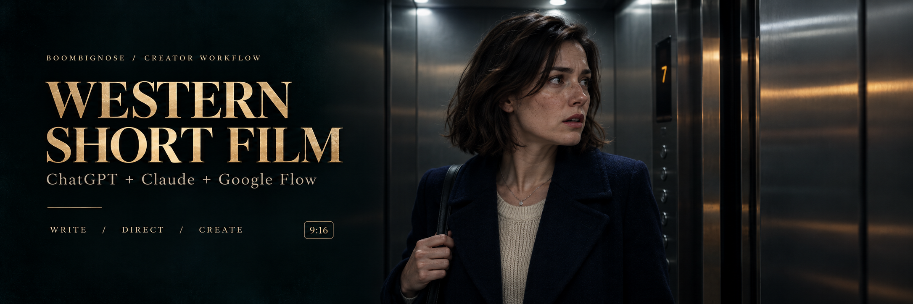
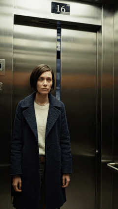
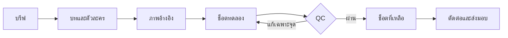

<div align="center">



# สร้างหนังสั้นฝรั่ง ให้เป็นเรื่องของคุณ

**จากไอเดียหนึ่งบรรทัด → บท → ตัวละคร → ช็อตวิดีโอ → งานพร้อมตรวจ**

คู่มือและพรอมป์ต์ภาษาไทยสำหรับ **ChatGPT · Claude · Google Flow**

[](https://github.com/Boom-Vitt/western-short-film-kit/actions/workflows/check.yml)
[](LICENSE)
[](prompts/MASTER-PROMPT.md)
[](examples/quick-demo.md)

**[เริ่มใช้](#quick-start) · [ดูคลิปตัวอย่าง](#demo) · [ลองหนึ่งช็อต](examples/quick-demo.md) · [ตัวอย่าง 6 ช็อต](examples/one-floor-below-48s.md) · [ผลทดสอบ](docs/TEST-REPORT.md)**

[ดาวน์โหลดชุดไฟล์ ZIP](https://github.com/Boom-Vitt/western-short-film-kit/archive/refs/heads/main.zip)

</div>

---

> **เริ่มได้โดยไม่เขียนโค้ด** — ใช้ชุดพรอมป์ต์นี้วางแผนใน ChatGPT หรือ Claude แล้วสร้างสื่อใน Google Flow ชุดไฟล์แจกฟรี ส่วนการเจนภาพ/วิดีโอใช้บัญชีและเครดิตตามบริการที่เลือก

## ในชุดนี้มีอะไร

| 🎬 เขียนเรื่อง | 🎭 ล็อกตัวละคร | 🎥 สร้างทีละช็อต | 🎧 ตรวจงาน |
|---|---|---|---|
| Hook · ความขัดแย้ง · หักมุม | ใบหน้า · ชุด · เสียง · reference | Storyboard · กล้อง · บทพูด | เสียงตรงคน · ภาพต่อเนื่อง · ซับ |

เหมาะกับครีเอเตอร์ที่อยากทำหนังฝรั่งแนวตั้ง ครูที่ต้องการตัวอย่างสอน และคนที่อยากใช้บรีฟเดียวข้าม ChatGPT/Claude เลือกแนวระทึกขวัญ โรแมนติก ไซไฟ หรือคาวบอยได้ สร้างเรื่องและตัวละครใหม่จากบรีฟของคุณ

<a id="quick-start"></a>

## เริ่มใช้ใน 3 ขั้นตอน

### 1 · เปิดแชตแล้วแนบไฟล์

ดาวน์โหลด ZIP และแตกไฟล์ เปิดแชตหรือ Project ของหนังเรื่องนี้ใน ChatGPT หรือ Claude วาง [MASTER-PROMPT.md](prompts/MASTER-PROMPT.md) เป็นคำสั่งตั้งต้น แล้วแนบ:

- [WORKFLOW.md](WORKFLOW.md) — ลำดับผลิตและเกณฑ์ตรวจ
- [PRODUCTION.md](templates/PRODUCTION.md) — แบบกรอกบรีฟและบันทึกช็อต
- [one-floor-below-48s.md](examples/one-floor-below-48s.md) — ตัวอย่างบทและพรอมป์ต์ครบตอน

ถ้าเครื่องมือที่ใช้แนบไฟล์ไม่ได้ ให้วางเนื้อหาลงในแชตใหม่แทน

### 2 · ส่งบรีฟนี้ แล้วเลือกเรื่อง

```text
ใช้เวิร์กโฟลว์ในไฟล์ที่แนบ ช่วยทำหนังสั้นฝรั่งแนวตั้ง 9:16
เป้าหมาย 48 วินาที 6 ช็อต ช็อตละ 8 วินาที ตัวละครหลักผู้ใหญ่หนึ่งคน
แนวระทึกขวัญ ฉากหลักหนึ่งแห่ง เปิดด้วยเหตุผิดปกติและหักมุมท้ายตอน
บทพูดภาษาอังกฤษ พร้อมคำแปลและคู่มือภาษาไทย
เสนอเรื่องใหม่ 3 แบบ แล้วพัฒนาแบบที่ฉันเลือก
ส่งบรีฟ character bible บท storyboard Prompt ภาพอ้างอิง
และ Prompt Google Flow แยกช็อตที่คัดลอกใช้เดี่ยว ๆ ได้
ตอนนี้ทำเอกสารและ Prompt ก่อน ยังไม่ใช้เครดิตสร้างสื่อหรือเผยแพร่
```

เปลี่ยนแนว ภาษา ตัวละครและความยาวในบรีฟได้ 48 วินาทีเป็นตัวอย่างเริ่มต้น

### 3 · ทดลองช็อตเดียวใน Flow

เปิด [ตัวอย่าง 8 วินาที](examples/quick-demo.md) คัดลอก Prompt ไปที่ [Google Flow](https://labs.google/fx/tools/flow) ตั้ง 9:16, 8 วินาที และหนึ่งผลลัพธ์ ตรวจโมเดลและเครดิตก่อนสร้าง ดูและฟังคลิปให้ครบก่อนทำช็อตที่เหลือ

**คู่มือ:** [คำสั่ง ChatGPT / Claude](prompts/MASTER-PROMPT.md) · [Google Flow](docs/GOOGLE-FLOW.md) · [ตัดต่อและซับ](docs/EDITING.md)

---

<a id="demo"></a>

## ลองจากตัวอย่าง

### 🛗 One Floor Below — ชั้นที่ไม่มีอยู่

<p align="center">
  <a href="assets/demo.mp4"></a>
</p>

<p align="center"><strong>คลิปทดลองจริง · Google Flow · 8 วินาที · 9:16</strong><br>
GIF ไม่มีเสียง · <a href="assets/demo.mp4">เปิด MP4 พร้อมเสียง</a> · <a href="docs/TEST-REPORT.md">อ่านผลตรวจ</a></p>

> คลิปนี้เป็น **ช็อตทดลองหนึ่งช็อต** ผลตรวจและข้อจำกัดระบุในรายงาน ยังไม่ได้เจนหนังครบ 48 วินาทีหรือทดสอบความต่อเนื่องข้ามช็อต

> “I know that tune.” — “ฉันจำทำนองนั้นได้”
>
> หญิงสาวกลับจากงานดึก ลิฟต์พาเธอไปชั้นที่ไม่รู้จัก พร้อมเสียงผิวปากที่พ่อเคยใช้เรียกเธอ แต่พ่อเสียไปแล้วสิบปี

| ตัวอย่าง | สิ่งที่ได้ | เปิดดู |
|---|---|---|
| **หนึ่งช็อต · 8 วินาที** | Prompt พร้อมวาง ผู้พูดหนึ่งคน checklist และคลิปทดลองจริง | [ลองเลย →](examples/quick-demo.md) |
| **หนึ่งตอน · 48 วินาที** | Character bible, storyboard, บทอังกฤษ/คำแปลไทย และ Prompt 6 ช็อต | [อ่านชุดเต็ม →](examples/one-floor-below-48s.md) |
| **แก้ช็อตที่ไม่ผ่าน** | คำสั่งแก้เสียงผิดคน หน้าเปลี่ยน และงานเจน error | [เปิดชุดแก้ไข →](prompts/REPAIR.md) |

ภาพปกเป็นภาพแนวคิดที่สร้างใหม่ด้วย imagegen ไม่ใช่เฟรมจาก Flow พรีวิว GIF มาจากคลิปทดลองจริง ดูแหล่งที่มาและสถานะการตรวจใน [TEST-REPORT](docs/TEST-REPORT.md)

<details>
<summary><strong>อีก 3 ไอเดียสำหรับเปลี่ยนบรีฟ</strong></summary>

| แนว | Hook ที่ลองใช้ได้ | สิ่งที่ต้องล็อก |
|---|---|---|
| โรแมนติก | คนที่รับสายโทรศัพท์เครื่องเก่า คือคนรักจากวันพรุ่งนี้ | โทรศัพท์ ห้อง และลำดับเวลา |
| ไซไฟ | ทุกครั้งที่ประตูรถไฟเปิด เธอเห็นตัวเองอายุต่างกัน | หน้าตา เสื้อผ้า และทิศประตู |
| คาวบอย | จดหมายที่นายอำเภอเพิ่งได้รับ ลงวันที่หลังวันตายของเขา | ชุด จดหมาย และเมือง |

เป็นไอเดียใหม่สำหรับพัฒนาเป็นบรีฟและบทก่อนสร้างสื่อ

</details>

## เวิร์กโฟลว์ที่ใช้



อ่านรายละเอียดและเกณฑ์ผ่านแต่ละขั้นใน [WORKFLOW.md](WORKFLOW.md)

## ทดสอบและตรวจคุณภาพ

สำหรับผู้ดูแล repo ใช้ Python 3.9+ โดยไม่ติดตั้งแพ็กเกจ:

```sh
git clone https://github.com/Boom-Vitt/western-short-film-kit.git
cd western-short-film-kit
python3 scripts/check_repo.py
python3 scripts/test_check_repo.py
```

บน Windows ที่ใช้คำสั่ง `python` ให้เปลี่ยน `python3` เป็น `python` ตัวตรวจเช็กเอกสาร assets storyboard และบท/ผู้พูดที่ตรงกับ Prompt [ผลการตรวจและขอบเขต](docs/TEST-REPORT.md)

**การตรวจเอกสารไม่ได้ยืนยันคุณภาพวิดีโอ** — ต้องเปิดดูและฟังคลิปจริงก่อนนำไปใช้เป็นงาน final

<details>
<summary><strong>แผนผังไฟล์</strong></summary>

```text
western-short-film-kit/
├── README.md                  ← เริ่มที่นี่
├── WORKFLOW.md                 ← ขั้นตอนผลิต
├── AGENTS.md                   ← คำสั่งสำหรับ local agent
├── assets/hero.png             ← ภาพปกแนวคิด
├── assets/demo.mp4 / demo.gif  ← คลิปทดลองและพรีวิวเงียบ
├── prompts/                    ← ผู้กำกับ / แก้ช็อต
├── templates/PRODUCTION.md     ← บรีฟและ production log
├── examples/                   ← ลอง 8 วินาทีและบท 6 ช็อต
├── docs/                       ← คู่มือและผลตรวจ
└── scripts/                    ← ตัวตรวจเอกสารแบบไม่ติดตั้งแพ็กเกจ
```

</details>

## คำถามที่เจอบ่อย

<details>
<summary><strong>ชุดนี้สร้างหนังให้เองอัตโนมัติไหม?</strong></summary>

เป็นชุด Prompt และ workflow ไม่มีบริการ API หรือระบบสร้างหนังติดตั้งมาให้ ใช้เครื่องมือที่บัญชีของคุณรองรับ และตรวจไฟล์จริงก่อนใช้

</details>

<details>
<summary><strong>ใช้ภาษาไทยหรือแนวอื่นได้ไหม?</strong></summary>

ได้ แก้ภาษาและแนวในบรีฟ [PRODUCTION](templates/PRODUCTION.md) ตัวอย่างเลือกอังกฤษพร้อมคำแปลไทยเพื่อสาธิตหนังกลิ่นอายตะวันตก

</details>

<details>
<summary><strong>ทำไมเริ่มจากหนึ่งช็อต?</strong></summary>

ช่วยตรวจหน้า ชุด จังหวะและเสียงก่อนทำช็อตที่เหลือ ไม่เสียทั้งเรื่องเมื่อพบปัญหาตั้งแต่ช็อตแรก ตัวอย่างหนึ่งช็อตไม่ได้พิสูจน์ความต่อเนื่องทั้งตอน

</details>

---

**ฟรี · ใช้ได้ · แก้ได้ · Fork ได้** ภายใต้ [MIT](LICENSE) เก็บประกาศสิทธิ์เมื่อนำไปแจกต่อ เงื่อนไขของบริการและสื่อที่ผู้ใช้เพิ่มยังเป็นของเจ้าของเดิม โครงการอิสระของ BoomBigNose ไม่ใช่ผลิตภัณฑ์ทางการของ OpenAI, Anthropic หรือ Google — [ที่มาและเครดิต](THIRD_PARTY_NOTICES.md)
