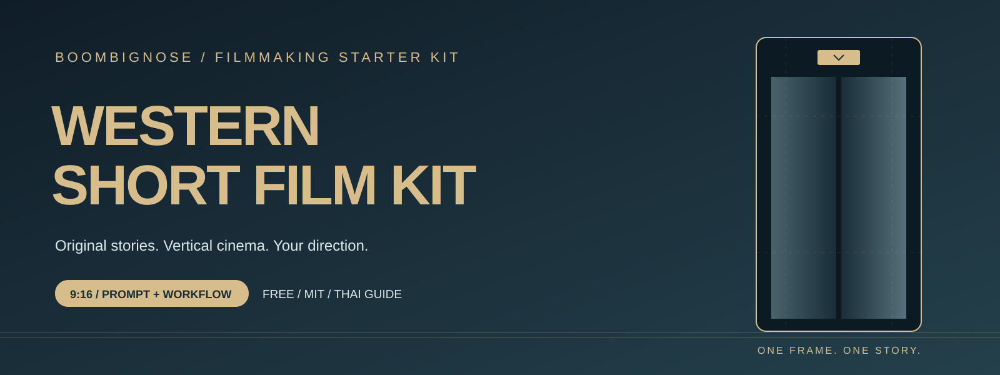
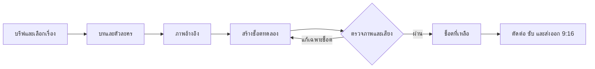

<div align="center">



# สร้างหนังสั้นฝรั่งแนวตั้งด้วย AI

**จากไอเดีย → บท → ตัวละคร → วิดีโอทีละช็อต → หนังพร้อมตรวจ**

ชุด Prompt และเทมเพลตแจกฟรี พร้อมคู่มือภาษาไทย สำหรับ **ChatGPT / Claude + Google Flow**

[](https://github.com/Boom-Vitt/western-short-film-kit/actions/workflows/check.yml)
[](LICENSE)
[](WORKFLOW.md)

[เริ่มใช้](#quick-start) · [หนังตัวอย่าง 48 วินาที](examples/one-floor-below-48s.md) · [คู่มือ Flow](docs/GOOGLE-FLOW.md) · [ตัดต่อและทำซับ](docs/EDITING.md)

[ดาวน์โหลด ZIP](https://github.com/Boom-Vitt/western-short-film-kit/archive/refs/heads/main.zip)

</div>

> **เริ่มได้โดยไม่เขียนโค้ด** — แจกฟรีเฉพาะชุดไฟล์นี้ การสร้างภาพ/วิดีโอมีค่าใช้จ่ายหรือเครดิตตามบริการและบัญชีที่ใช้ ตัวอย่างเป็นบทและ Prompt ที่แต่งใหม่ **ยังไม่มีวิดีโอที่เรนเดอร์หรือผ่านการตรวจภาพเสียง**

“หนังฝรั่ง” ในชุดนี้หมายถึงหนังสั้นกลิ่นอายภาพยนตร์ตะวันตก เช่น ระทึกขวัญ โรแมนติก ไซไฟ หรือคาวบอย เลือกแนวเองได้ ใช้ตัวละครและเรื่องใหม่ ไม่ต้องมีฟุตเทจหนังต้นฉบับ

## ได้อะไรในชุดนี้

| ไฟล์ | ใช้ทำอะไร |
|---|---|
| [MASTER-PROMPT](prompts/MASTER-PROMPT.md) | ให้ AI ช่วยเป็นผู้กำกับ เขียนบทและแยกช็อต |
| [PRODUCTION](templates/PRODUCTION.md) | กรอกบรีฟ ล็อกตัวละคร ฉาก เสื้อผ้า เสียง และบันทึก take |
| [One Floor Below](examples/one-floor-below-48s.md) | ตัวอย่างครบ 6 ช็อต พร้อมบทอังกฤษ คำแปลไทย และ Prompt ภาพ/วิดีโอ |
| [WORKFLOW](WORKFLOW.md) | ทำตามตั้งแต่ไอเดียถึงส่งออก 9:16 |
| [REPAIR](prompts/REPAIR.md) | แก้หน้าเปลี่ยน เสียงผิดคน หลุดบท และงานเจนล้มเหลว |
| [EDITING](docs/EDITING.md) | ตัดต่อ ทำซับ ตรวจบนมือถือ และส่งออกไฟล์ |

<a id="quick-start"></a>

## เริ่มใน 3 ขั้นตอน

### 1. ดาวน์โหลด แล้วเปิดแชตใหม่

แตก ZIP เปิดแชตของหนังเรื่องนี้ใน ChatGPT หรือ Claude คัดลอก [MASTER-PROMPT.md](prompts/MASTER-PROMPT.md) เป็นคำสั่งตั้งต้น แนบหรือวางเนื้อหาของ [WORKFLOW.md](WORKFLOW.md), [PRODUCTION.md](templates/PRODUCTION.md) และ [ตัวอย่าง](examples/one-floor-below-48s.md) ตามเครื่องมือที่บัญชีของคุณรองรับ

### 2. ส่งบรีฟนี้

```text
ช่วยทำหนังสั้นฝรั่งแนวระทึกขวัญ 9:16 ความยาวเป้าหมาย 48 วินาที
6 ช็อต ช็อตละ 8 วินาที ตัวละครหลักผู้ใหญ่หนึ่งคน ฉากหลักหนึ่งแห่ง
บทพูดภาษาอังกฤษ พร้อมคำแปลและคู่มือภาษาไทย
เปิดด้วยเหตุผิดปกติ ให้ภาพเล่าเรื่อง และจบด้วยปมชวนติดตาม
เสนอเรื่องใหม่ 3 แบบ แล้วรอฉันเลือกเรื่อง
จากนั้นส่ง character bible, storyboard, Prompt ภาพอ้างอิง
และ Prompt วิดีโอแยกช็อตที่คัดลอกใช้เดี่ยว ๆ ได้
ตอนนี้ทำบทและ Prompt เท่านั้น ยังไม่ใช้เครดิตสร้างสื่อ
```

เปลี่ยนแนว ภาษา ตัวละคร และความยาวได้ในเทมเพลต ตัวอย่าง 48 วินาทีเป็นจุดเริ่มต้น ไม่ใช่ข้อจำกัดของเรื่องใหม่

### 3. ลองสร้างช็อตเดียวก่อน

ใช้ Prompt ภาพตัวละครใน [ตัวอย่าง](examples/one-floor-below-48s.md) สร้างและเลือก reference ก่อน เปิด [Google Flow](https://labs.google/fx/tools/flow) แล้วทำ **S01** ตาม [คู่มือ](docs/GOOGLE-FLOW.md): ตรวจโมเดล, 9:16, 8 วินาที, จำนวนผลลัพธ์หนึ่ง และเครดิตจริงก่อนกดสร้าง ดูและฟังคลิปให้ครบก่อนทำ S02–S06

**ไม่ต้องติดตั้ง Python เพื่อใช้ Prompt** และการวาง Prompt ไม่ได้เพิ่มความสามารถควบคุมเว็บหรือสร้างสื่อให้แชตโดยอัตโนมัติ

## เรื่องตัวอย่าง: One Floor Below — ชั้นที่ไม่มีอยู่

> หญิงสาวกลับจากงานดึก ลิฟต์พาเธอไปชั้นที่ไม่รู้จัก พร้อมเสียงผิวปากที่พ่อเคยใช้เรียกเธอ แต่พ่อเสียไปแล้วสิบปี

บทอังกฤษ · คำแปลไทย · ตัวละครผู้ใหญ่หนึ่งคน · ฉากลิฟต์ · 6 × 8 วินาที · ไม่มีความรุนแรงโจ่งแจ้ง

[เปิดตัวอย่างครบชุด →](examples/one-floor-below-48s.md)

## วิธีทำงาน



## ตรวจชุดไฟล์

สำหรับผู้ดูแล repo ใช้ **Python 3.9+** โดยไม่ติดตั้งแพ็กเกจ:

```sh
python3 scripts/check_repo.py
python3 scripts/test_check_repo.py
```

บน Windows ที่ใช้คำสั่ง `python` ให้เปลี่ยน `python3` เป็น `python` ตรวจไฟล์อ้างอิง, storyboard 48 วินาที, บท/ผู้พูดใน Prompt และกรณีเอกสารผิดพลาด ดูขอบเขตใน [TEST-REPORT](docs/TEST-REPORT.md)

## ฟรี ใช้ได้ แก้ได้ Fork ได้

ชุดเอกสาร Prompt เทมเพลต ตัวอย่าง และโค้ดแจกภายใต้ [MIT](LICENSE) เก็บประกาศสิทธิ์เมื่อนำไปแจกต่อ ส่วนบัญชี โมเดล เครดิต และสื่อที่นำเข้า/สร้างจากบริการอื่นใช้เงื่อนไขของบริการนั้น

โครงการอิสระของ BoomBigNose ไม่ใช่ผลิตภัณฑ์ทางการของ OpenAI, Anthropic หรือ Google โครงสร้างและตัวตรวจเอกสารต่อยอดจากชุดหนังจีนเดิม: [ที่มาและเครดิต](THIRD_PARTY_NOTICES.md)
